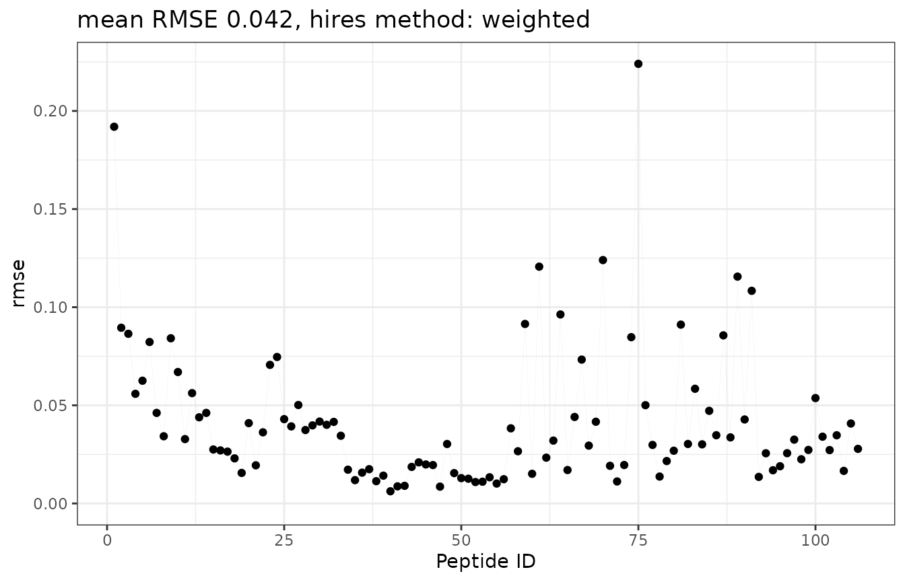

# Results validation

## How to validate the results?

This article describes the featured methods of validation of the HRaDeX
workflow, based on the peptide uptake curve fitting, and the aggregation
of fitted parameters from the peptide level into high-resolution. As
this process is dependent on many parameters, we offer the possibility
to validate the analysis in multiple steps.

For more information about the workflow check dedicated
[article](https://hadexversum.github.io/HRaDeX/articles/workflow.html).

Let’s start with running the analysis, using exemplary
[data](https://doi.org/10.1093/nar/gkac685), and default parameters.

``` r
protein_length <- 224 + 1 ## as r3dmol counts differently

# calucalting deuterium uptake for the alpha component
kin_dat <- HRaDeX::prepare_kin_dat(alpha_dat, 
                                   state = "Alpha_KSCN",
                                   time_0 = 0,
                                   time_100 = 1440)

fit_k_params <- data.frame(
  start = c(k_1 = 2, k_2 = 0.2, k_3 = 0.02),
  lower = c(k_1 = 1, k_2 = 0.1, k_3 = 0.0001),
  upper = c(k_1 = 30, k_2 = 1, k_3 = 0.1))

# the fitting process for the whole peptide pool
fit_values <- create_fit_dataset(kin_dat, 
                                 fit_k_params = fit_k_params, 
                                 trace = F, 
                                 fractional = T, 
                                 workflow = 321)

# aggregation of the peptide level results in high-resolution data
hires_params <- calculate_hires(fit_values,
                                fractional = T, 
                                method = "weighted",
                                protein_length = protein_length)
```

### Fit selection

Depending on the supplied data, the fitting process for each peptide
includes fitting all selected possible functions: three-, two- and
one-component exchange functions. The best-fitted model is selected
based on the BIC value. Although it is impossible to investigate the
results of all possible models, we can analyze the chosen one.

The BIC values are presented in the data frame containing fitting
results, as well as RSS. Then, it is possible to draw the fitted model
alongside the experimental data to control if the result is
satisfactory.

Here we present the results for one, selected peptide DVAAF:

``` r
example_fit_dat
#>    id   Protein      State sequence start end max_uptake       n_1      k_1
#> 1 106 db_eEF1Ba Alpha_KSCN    DVAAF   217 221          4 0.4973596 9.334779
#>         n_2 k_2       n_3        k_3          rss       bic class_name    k_est
#> 1 0.1422129   1 0.3623463 0.06211225 7.381055e-06 -52.08054         NA 4.798254
#>   fitted   color
#> 1      3 #7F245C
```

``` r
plot_double_uc(example_kin_dat, example_fit_dat)
```


On the right panel, there is a normalized experimental uptake curve,
with a logarithmic time scale. The circles mark the fractional deuterium
uptake. Inside the circles, there are error bars presenting the combined
uncertainty of the measured fractional deuterium uptake. Due to the
quality of the presented data, the error bars are barely visible. The
black line indicates the fitted three-component exchange function, while
the red, green, and blue lines indicate the components of the fitted
(fast, medium, and slow exchanging group, respectively). On the right,
there is an uptake curve presenting deuterium uptake in Daltons, for
users to grasp an understanding of uptake curve types.

This function can be plotted for any peptide, preferably ones selected
by the user, e.q. with the greatest RSS values.

- Future plans: package function to create the pdf file with all of the
  uptake curves.\*

#### In GUI

In the `UC plots` tab, there are listed plots (the ones described just
above) for all of the available peptides. Those plots are static,
serving the purpose of a quick glimpse of the quality of the fits. For
more in-detail analysis, there are plots available upon clicking the
selected peptide name in the table with parameters, in the `Fit params`
tab. Not only there are precise numeric values presented in the table,
but the plots below are interactive.

### Region classification consistency

Before the final data aggregation step, it is important to check if the
classification results are consistent for overlapping peptides within
regions. The peptides close to each other should be classified
similarly, which can be noted by the presence of similar colors. The
long peptides (with lengths exceeding 10 amino acids) should be treated
carefully, as in their case it is harder to pinpoint the exact region of
exchange and distinguish between the exchange rates of the residues.

The plot below shows the coverage plot with assigned color-code
classification. We can see that the medium part - the linker of the
alpha compound - is exchanging very fast due to a lack of protection.
The C- and N-terminus parts of the protein show the consistency of
region classification.

``` r
HRaDeX::plot_cov_class(fit_values)
```

#### In GUI

This plot can be found in the `Overview` tab, as the fourth plot from
the top.

### High-resolution results

Once we have the data aggregated into the high-resolution level, using
one of two available methods, we can take a step back and calculate the
deuterium uptake for each peptide using the high-resolution data for
amino acids building that peptide. Then, we plot the result next to the
experimental data to check the goodness of the data. Then, we calculate
the MRSE - for each peptide and the whole peptide pool.

Here, we use the `weighted` approach.

The comparison of recovered deuterium uptake and experimental deuterium
uptake can be presented on the plot:

``` r
recreate_uc(example_kin_dat, fit_values, hires_method = "weighted")
#> Warning in stat_function(fun = function(x) {: All aesthetics have length 1, but the data has 6 rows.
#> ℹ Please consider using `annotate()` or provide this layer with data containing
#>   a single row.
#> Warning in stat_function(fun = function(x) {: All aesthetics have length 1, but the data has 6 rows.
#> ℹ Please consider using `annotate()` or provide this layer with data containing
#>   a single row.
```


This plot shows three pieces of information: the black points present
the experimental deuterium uptake, the blue line presents the fitted
three-component exchange function, and the red line presents the
recovered deuterium uptake values from high-resolution data. As we see,
the recovered uptake curve preserves the type of exchange and recovered
values are close to the experimental ones.

But judging goodness by the eye is not sufficient. We need a more
objective criterion - RMSE.

``` r
# recreating the uptake values for peptides
rec_uc_dat_alpha <- create_uc_from_hires_dataset(kin_dat,
                                                fit_values,
                                                hires_method = "weighted")
# calcuation of RMSE
rec_uc_rmse_dat_alpha <- calculate_recovered_uc_rmse(rec_uc_dat_alpha, sort = "ID")
```

The calculated RMSE for each peptide can be presented in two forms:

1.  as `butterfly` plot. The Y-axis shows the RMSE values and the X-axis
    shows the peptide by their ID. Although this plot offers an overview
    of values and enables the choice of a satisfactory threshold, it
    lacks information on length and position within the protein
    structure.

``` r
plot_recovered_uc_coverage(rec_uc_rmse_dat_alpha, style = "butterfly")
```



2.  as a `coverage` plot. Here, the RMSE values are shown in the
    intensity of the red color, and the peptide position and length are
    presented on the protein sequence.

``` r
plot_recovered_uc_coverage(rec_uc_rmse_dat_alpha, style = "coverage")
```


The total RMSE from all peptides is 0.0418 using the `weighted`
aggregation approach.

#### In the GUI

This step is currently only available on the package side, but it will
be featured in the web server as well when the time comes.

### What to improve?

We controlled the steps of the analysis, and what to do next. If there
are some inconsistencies that are affecting the final result, it may be
beneficial to re-run the analysis with changed parameters. Sometimes,
when the regions of protein undergo the exchange slowly, the `slow`
exchange group should be shifted, leaving the `medium` exchange ranges
more broad.
