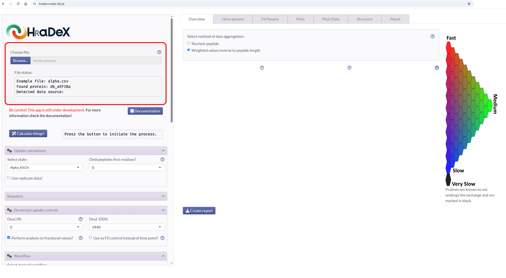
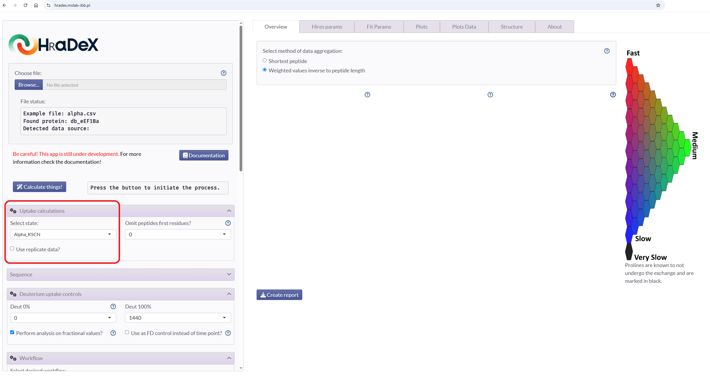
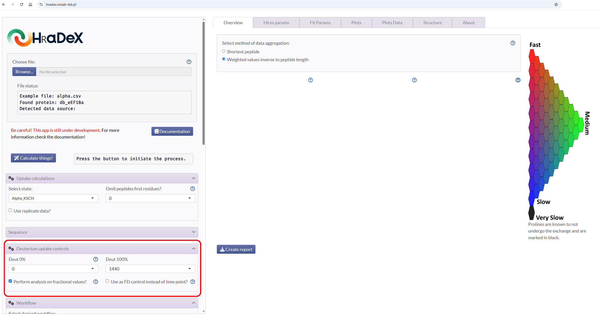
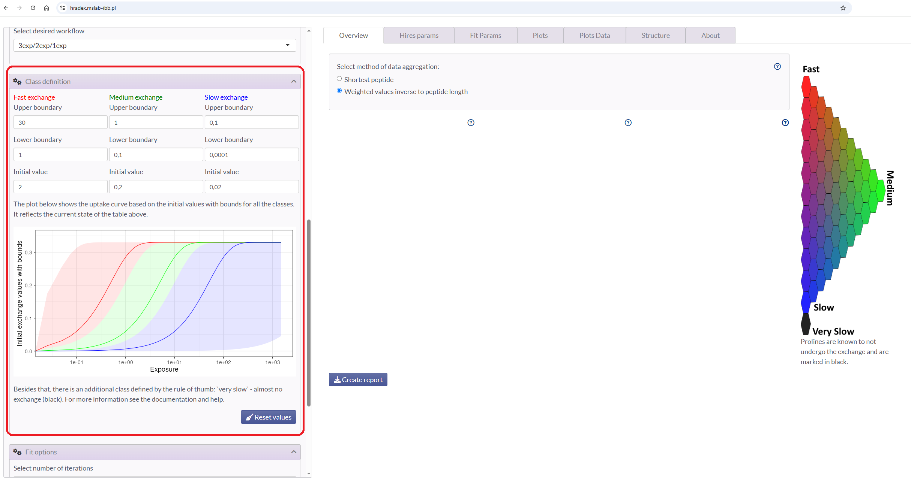
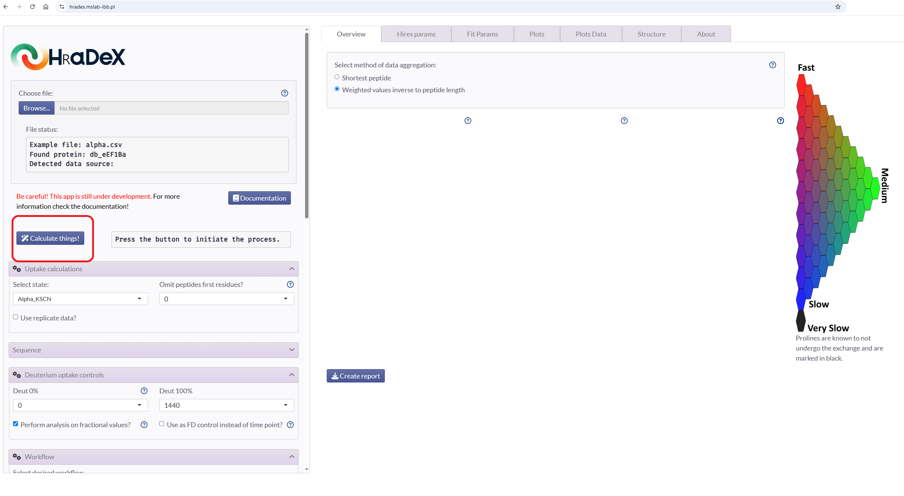

Here, we describe basic steps to pay attention to while using HRaDeXGUI. For more detailed description, check the helpers in the application (indicated by circled quesition marks next to elements) or read the documentation e.q. `vignette("gui_guide")`.

# Upload file

Upload datafile and check the message below.

{width=100%}

# Check the selected state

HrRaDeX run single-state analysis, so make sure the correct state is chosen.

{width=100%}

# Check the controls

As the recommended data format is fractional, make sure that the undeuterated and fully deuterated control are selected correctly.

{width=100%}

# Check exchange groups

Next, scroll down the settings panel and check if the exchange group limits are correct. You may change them, if the analysis results are unsatisfatory.

{width=100%}

# Run the analysis

If all the settings are acceptable, run the analysis by clicking the button.

{width=100%}

Enjoy the results!
