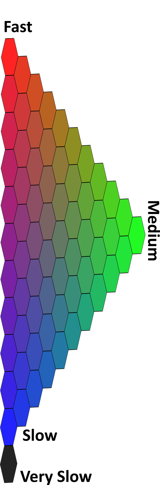

```{r, include = FALSE}
knitr::opts_chunk$set(
  collapse = TRUE,
  comment = "#>"
)
```

```{r setup, include = FALSE}
library(HRaDeX)
library(HaDeX)
library(ggplot2)
library(dplyr)

```


# Introduction

This document is an adapted version of the Supplement to the HRaDeX manuscript.

Here we describe the exemplary step-by-step analysis of experimental data using the hadexversum family tools: [HaDeX](https://hadex2.mslab-ibb.pl/), [HRaDeX](https://hradex.mslab-ibb.pl/) and [compaHRaDeX](https://compahradex.mslab-ibb.pl/). 

The analyzed protein is the eEF1Bα subunit of the human guanine-nucleotide exchange factor (GEF) complex (eEF1B), measured in [Mass Spectrometry Lab](https://mslab-ibb.pl/) in [Institute of Biochemistry and Biophysics Polish Academy of Sciences](https://ibb.edu.pl/en/) and published by [Bondarchuk et al](https://doi.org/10.1093/nar/gkac685). In the one-state classification, we will focus on pure alpha state. The comparative analysis is conducted between pure alpha state and alpha in presence of gamma component.  

We present the visualization methods of hadexversum, without making strict interpretations. For that purpose, we suggest contacting the research group that published original research on this topic.


# HaDeX 

## General information 

HaDeX is a general-use tool for widely understood data analysis on the peptide level. It provides many features for investigating directly the mass measurements and checking the experiment quality. HaDeX provides many methods of quality control of the experiment with in-depth analysis of measurements, uncertainty, and statistical significance. Not only commonly used forms of visualization are available, but also new methods are proposed. The summary of the results is wrapped in a comprehensive, downloadable report.

In this document, we focus on visualization forms corresponding with high-resolution data.


## Peptide-level uptake analysis

To see both the uptake level (with uncertainty of measurement) and the position of each peptide on the protein sequence, we use the comparison plot. For readability purposes, on this type of plot, we can present the data only for a single time point. However, a quick glimpse of the plot enables a general view of the exchanged regions. 
```{r include=F}
uptake_dat <- create_uptake_dataset(alpha_dat,
                                    states = c("Alpha_KSCN", "ALPHA_Gamma"),
                                    time_0 = 0, 
                                    time_100 = 1440)
```

```{r fig.width=7}
HaDeX::plot_state_comparison(uptake_dat,
                             fractional = T,
                             time_t = 150)

```


Let’s suppose we aim for the comparative analysis of two biological states. In that case, we use the so-called Woods plot, with differences in uptake for each peptide and information on which differences are statistically significant for the desired level. As for the comparison plot, we only present the data for a single time point. 


```{r fig.width=7}
diff_p_uptake_dat <- create_p_diff_uptake_dataset(alpha_dat,
                                                  state_1 = "Alpha_KSCN",
                                                  state_2 = "ALPHA_Gamma")

HaDeX::plot_differential(diff_p_uptake_dat = diff_p_uptake_dat,
                         fractional = T, 
                         show_houde_interval = T, 
                         time_t = 150) +
  labs(title = "Differential plot in 150 min between Alpha and Alpha+Gamma state")
```


This plot presents the results for the measurement done after 150 min of exchange. It shows one significant exchange region - between positions 5 and 50 and two regions with values barely above the significance level.


# HRaDeX

```{r include = FALSE}

protein_length <- 224 + 1 ## r3dmol counts differently

kin_dat <- HRaDeX::prepare_kin_dat(alpha_dat, 
                                   state = "Alpha_KSCN",
                                   time_0 = 0,
                                   time_100 = 1440)

fit_values <- create_fit_dataset(kin_dat, 
                                 fit_k_params = get_example_fit_k_params(), 
                                 trace = F, 
                                 fractional = T, 
                                 workflow = 321)

hires_params <- calculate_hires(fit_values,
                                fractional = T, 
                                method = "weighted",
                                protein_length = protein_length)


```

## General information 

HRaDeX provides classification results for one biological state at a time. To get data for comparative purposes, the classification process should be conducted twice, on selected states, with the same classification parameters. Adjusting the parameters can be challenging, especially for longer proteins due to the calculation time. In this document, we discuss the results. The detailed description of the workflow is available in the dedicated article.

## High-resolution dynamics analysis

Firstly, we upload the experimental data. The parameter options are adjusted to the content of the file.

Then, we need to decide if the default parameters are sufficient or should be adjusted. Any additional knowledge about the specificity of analyzed protein is helpful. Some of the peptides have a strong “medium” exchange phase shifted towards default “slow” exchange, with “slow” exchange being very slow, close to the bottom limit of class exchange. In such cases, the broadening of the medium class is desired. 

In the case of our example, we use the default limits, as they are sufficient and the fit results are very good, with small rss. The default parameters are as follows:

```{r}
get_example_fit_k_params()
```


All parameters must be confirmed by clicking the button, to avoid unnecessary calculations while selecting the parameters.

After a while, we have the results. 

Let’s start with discussing the fitting results for example peptide - peptide DVAAF from the alpha protein.

Below, there is a plot with two parts - a normalized uptake curve with a fitted model and the uptake curve only with measurements, for a better understanding of the uptake pattern.

Let's look closely on the left plot. Measurement points are marked by circles, with the uncertainty of the measurement shown by the error bars. Mass spectrometry is a very accurate method, and the error bars are hardly visible, although present. The black line indicates the final fitted curve, with color lines indicating the three components of the final model. As described before, the red line presents the fast component, the green line is the medium exchange component, and the blue line is the slow component. Although all populations sum up to one, each population has its intensity that impacts the final classification. 

```{r  include = FALSE}
example_fit_dat <- filter(fit_values, id == 106)
example_kin_dat <- filter(kin_dat, ID == 106)

```

```{r fig.width=7}
plot_double_uc(example_kin_dat, example_fit_dat)

```

The model parameters are shown below, and the resulting classification color is below the table.

```{r}
example_fit_dat
```
 As we can see, the population of the fast-exchanging group is the biggest, thus the final color is close to red. However, the other groups are present and interfere with the purity of the color. The noticeable slow exchanging group is pushing the classification color towards blue, resulting in a violet-ish shade.  The small addition of green leads to the subdued color. Below you can find a legend, to have an understanding of where in the color scale this classification result is located.


```{r, fig.width=2, fig.height=2, echo=F}

ggplot() + 
  geom_rect(aes(xmin=0, xmax=1, ymin=0, ymax=1), fill = example_fit_dat[["color"]]) +
  theme_bw() +
  theme(panel.border = element_blank(), panel.grid.major = element_blank(),
        panel.grid.minor = element_blank(),
        axis.ticks.x = element_blank(), axis.ticks.y = element_blank(),
        axis.text.x = element_blank(), axis.text.y = element_blank())

```


Color legend:

<!--  -->

```{r out.width="30%", echo = FALSE}

```


After each peptide is assigned a color code, we aggregate the data to obtain the simplified high-resolution result. This mid-step towards high-resolution is also used as method verification. In this case, we see that the peptides in regions are classified similarly, and the data aggregation is justified. 

```{r}
HRaDeX::plot_cov_class(fit_values)
```

For each residue in the protein structure, we aggregate the values using the selected method. The methods are described in the article discussing the workflow. Here, we use the "weighted" approach.

The classification of the whole sequence is presented below.


```{r}
HRaDeX::plot_hires(hires_params)
```

However, presenting the classification results in a linear way is not quite satisfying. Adding the spatial information, obtained from different sources, provides additional depth to our analysis. 

```{r}
HRaDeX::plot_3d_structure_hires(pdb_file_path = "../data/Model_eEF1Balpha.pdb",
                                hires_params = hires_params)
```


Here, we can make some additional observations. First, let’s look at the first part of the protein. Although the green region on the classification linear plot is interrupted by red regions, spatially the green regions are close, surrounded by the red region, on the outer side of the protein - as we suspect. On the second part of the protein, the regions with similar classifications are close to each other as well. We can see clearly that the blue regions of slow exchange are close, located in one specific place. 
The linking between two parts of the protein is red - as we expect, as it is a singular structure, easily accessed by the solvent, and without structural protection from the exchange.

Here we discussed only one biological state, but for the second one, the reasoning is similar.

# compaHRaDeX

```{r include=F}

kin_dat_2 <- HRaDeX::prepare_kin_dat(alpha_dat, 
                                   state = "ALPHA_Gamma",
                                   time_0 = 0,
                                   time_100 = 1440)

fit_values_2 <- create_fit_dataset(kin_dat_2, 
                                 fit_k_params = get_example_fit_k_params(), 
                                 trace = F, 
                                 fractional = T, 
                                 workflow = 321)

hires_params_2 <- calculate_hires(fit_values_2,
                                fractional = T, 
                                method = "weighted",
                                protein_length = protein_length)
```

## High-resolution comparative analysis

The ultimate goal of the experiment is usually the comparative analysis between two biological states that provides information on how the exchange is changed by specific factors. In this case, we prepared a classification analysis for two biological states of alpha: the pure state (discussed above is alpha without complex) and the second state (alpha in the presence of gamma).

Below we present the classification results for both states, the first one on the bottom and the second one on the top. We can see with bore eye the regions of difference.

```{r}
HRaDeX::plot_two_states(hires_params, hires_params_2)
```


Unfortunately, it is hard to estimate the difference between the colors. We can quantify the color difference into one number, calculating the simple distance between populations used to obtain the classification color.

```{r}
two_states <- HRaDeX::create_two_state_dataset(hires_params, hires_params_2)
HRaDeX::plot_color_distance(two_states)
```

In this case, we see a great difference in region 10-50 of the sequence, second region 140-155, and third 200-210, roughly estimating. Choosing 0.2 as the threshold of distance value, we can present the regions of difference on the 3D structure, as presented below.

```{r}
color_positions <- HRaDeX::prepare_diff_data(two_states,
                                             "dist",
                                             0.2)
HRaDeX::plot_3d_structure_blank(pdb_file_path = "../data/Model_eEF1Balpha.pdb") %>%
  r3dmol::m_set_style(sel = r3dmol::m_sel(resi = color_positions),
            style = r3dmol::m_style_cartoon(color = "aquamarine"))

```


As the distance between populations plot shows us the regions of interest, doesn't show the direction of change - if the region is protected from exchange or the contrary. To account for that, we propose a rough estimate of the exchange rate based on the parameters of the model, as defined in the workflow description article.

```{r}
HRaDeX::plot_k_distance(two_states)
```


We can see the obvious difference in the first part of the protein, in the same region as shown in the Woods plot above. We also see a small difference from Woods's plot in the second part of the protein. Although the results are somehow analogical, the high-resolution approach accounts for the whole time course. 

# Availability

HaDeX is available as a [web-server](https://hadex.mslab-ibb.pl/), [R package](https://cran.r-project.org/web/packages/HaDeX/index.html), and [standalone software](). The first version is already [published](https://academic.oup.com/bioinformatics/article/36/16/4516/5862011) and the second version is in advanced state - [HaDeX2](https://hadex2.mslab-ibb.pl/). 


Both HRaDeX and compaHRaDeX use code from HRaDeX [R package](https://github.com/hadexversum/HRaDeX). The HRaDeX application is available [here](https://hradex.mslab-ibb.pl/), with open [source code](https://github.com/hadexversum/HRaDeXGUI). compaHRaDeX is available [here](https://compahradex.mslab-ibb.pl/), as well as application [source code](https://github.com/hadexversum/compahradex).


